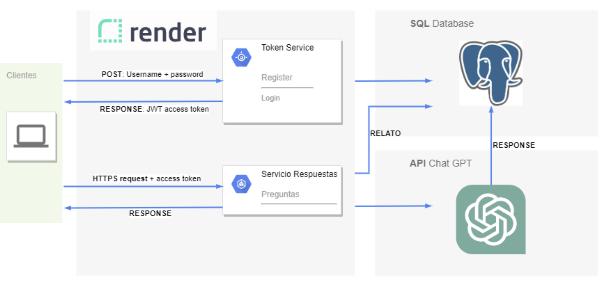

# Título del Proyecto

API Flask de consulta de Polizas de Seguro - Proyecto Aplicado II - MIA UC - 2023.

## Configuración de Ambiente

La API que contiene los metodos necesarios de Polizas de Seguro se despliega en el servidor de aplicaciones gratuito RENDER. 
Los resultados se guardan en ElephantSQL y se interactua en el Backend con CHATGPT para desbloquear capacidades de IA 

### Render

Se despliegan dos ambientes con tier gratuito dev y prod. Ademas se crea un ambiente de failover en caso de alta latencia propia del free tier. 

### ElephantSQL

Se despliegan dos bases de datos PostgreSQL (Free Tier) en el servicio ElephantSQL.

### Config Variables

En cada una de las aplicaciones desplegadas en Render , se deben establecer dos variables de entorno:

- URL de base de datos (Se obtiene de ElephantSQL)
- KEY de CHATGPT (Se obtiene de la cuenta OpenAI)

## CI/CD Desarrollo

Para el despliegue en desarrollo se ocupa el AutoDeploy que ofrece Render, permitiendo al equipo desplegar sus cambios rapidamente cada vez que se hace un Merge en la rama "dev"

## CI/CD Producción

Para produccion es diferente ya que no queremos pasar cambios si no estamos seguro que nada se va a romper e indisponibilizar el servicio. Es por ello que ocupamos Github actions los cuales se encuentran en la capeta .github/workflows del Repositorio 

Este proceso se gatilla a partir de un Pull Request de dev a main posterior a una aprobacion de un Release Manager y alguien del equipo de desarrollo. 

## Métodos de la API

Se pueden consultar los metodos de la API en swagger-ui el cual se encuentra desplegado dentro de la imagen docker. Las URLs son:

Dev

https://infra-api-dev.onrender.com/swagger-ui

Prod 

https://infra-api-prod.onrender.com/swagger-ui

